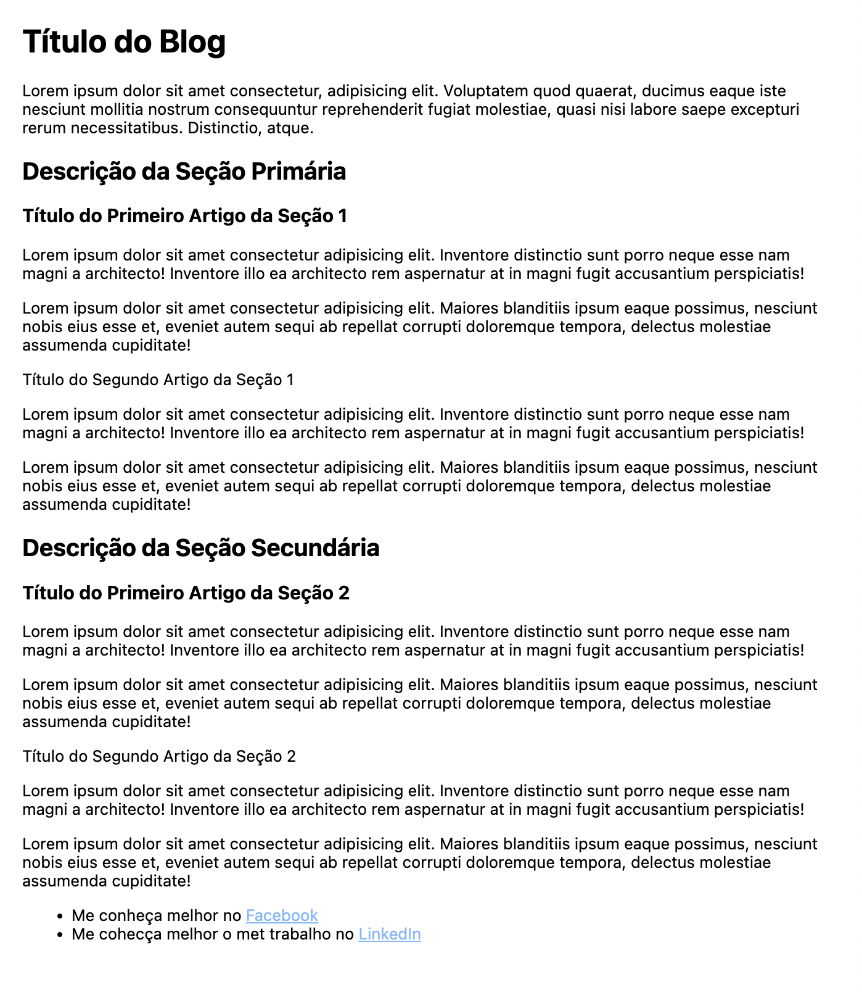
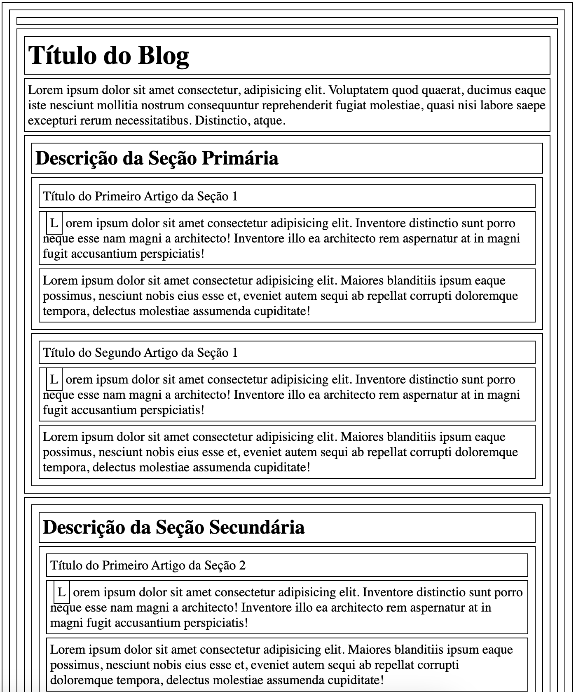
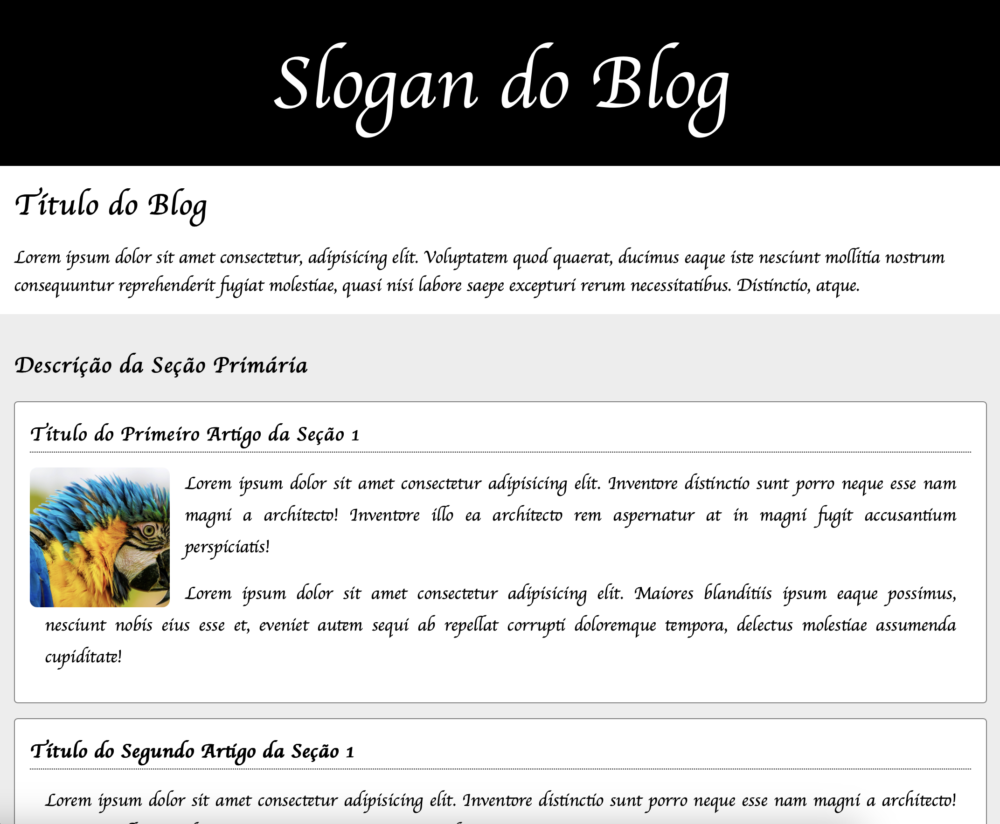
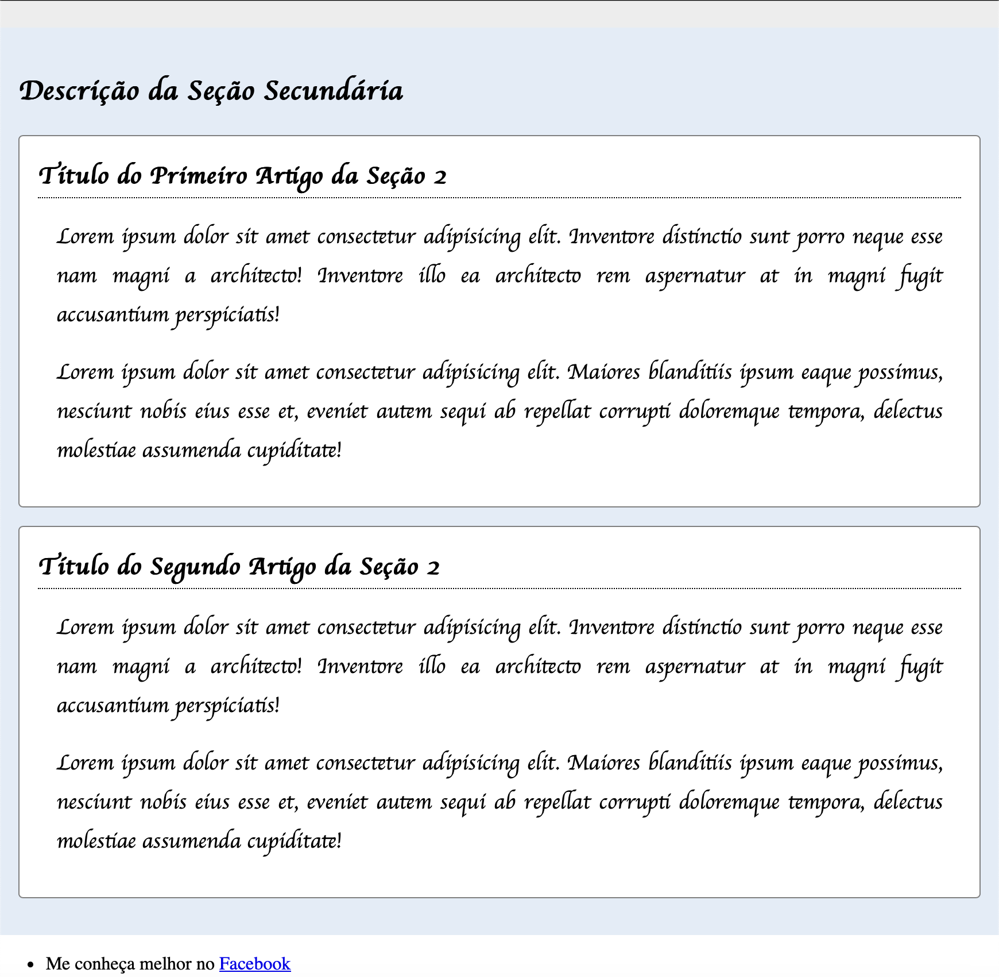

# Tutorial BoxModel

Esta tutorial tem por objetivo reforçar o cocnhecimento sobre os fundamentos do CSS já apresentados em sala de aula.

O `BoxModel` é um dos principais fundamentos para o efetivo entendimento sobre os elementos do HTML ou seja as **TAGs**.

Cada TAG possuis propriedades comuns como margin, padding, border, color, background-color, dentre outras.

> Lembre-se uma TAG é uma caixa que pode ser configurada de múltiplas maneiras e compreender as principais propriedades das caixas fará total diferença para seu sites futuros e como voce irá estilá-los.

## Criando um Blog

Um blog é um site um site especializado em um determinado assunto, por serem extremamentte específicos tornam-se referências no assunto muito facilmente.

No início dos anos 2000, os blogs colaboraram com o surgimento da Web 2.0, nesta época o conteúdo dos sites que antes eram providos apenas por empresas de comunicação e grandes portais de noticias. Os blogs eram uma espécie de diário on-line.

Com a Web 2.0 começava a popularização e consolidação dos Blogs com uma fonte de comunicação de forte poder de influencia que dava a capacidade de pessoas comuns desenvolverem sites e influenciar cada vez mais pessoas, assim iniciava-se a nova Web onde pessoas comuns geravam conteúdos e foi o primórdio dos influencers que conhecemos hoje.

Agora que você entendeu a importancia de um blog; é hora de voce criar o seu!

Porem, vamos relembrar algumas tags e formatar as nossas TAGs compreendendo efetivamente o `BoxModel`.



### A estrutura do Blog

Ao observarmos a estrutura do texto, podemos perceber uma hierarquia entre o os conteúdos apresentados.

Podemos destacar o título do Blog com maior destaque, a seguir podemos notar 2 seções separando o conteúdo em 2 áreas de destaque ou seções; em cada uma destas seções nós podemos perceber o destaque de 2 artigos em específico onde, apresentamos o conteúdo propriamente dito em uma hierarquia sematicamente distribuída.

> Vamos criar esta estrutura e aplicar as estilizações em BoXmodel.

### Hands On - É sua vez

Agora você irá criar o blog, para tal, siga as instruções abaixo:
1. Crie um diretório chamado meu_blog;
2. Crie o arquivo `index.html` dentro do diretório meu_blog;
3. No arquivo `index.html` inclua o código em HTML abaixo.

```html
<!DOCTYPE html>
<html lang="pt-br">
<head>
    <meta charset="UTF-8">
    <meta name="viewport" content="width=device-width, initial-scale=1.0">
    <title>Meu Blog</title>
</head>
<body>
    <header></header>
    <main>
        <h1>Título do Blog</h1>
        <!--Descrição do Blog-->
        <p>Lorem ipsum dolor sit amet consectetur, adipisicing elit. Voluptatem quod quaerat, ducimus eaque iste nesciunt mollitia nostrum consequuntur reprehenderit fugiat molestiae, quasi nisi labore saepe excepturi rerum necessitatibus. Distinctio, atque.</p>
        <!--Seção de conteúdo 1 - Separação de áreas distintas de conteúdo -->
        <section>
            <!--Descrição de seção -->
            <h2>Descrição da Seção Primária</h2>
            <!--Primeiro Artigo da seção-->
            <article>
                <header>Título do Primeiro Artigo da Seção 1</header>
                <p><span>L</span>orem ipsum dolor sit amet consectetur adipisicing elit. Inventore distinctio sunt porro neque esse nam magni a architecto! Inventore illo ea architecto rem aspernatur at in magni fugit accusantium perspiciatis!</p>
                <p>Lorem ipsum dolor sit amet consectetur adipisicing elit. Maiores blanditiis ipsum eaque possimus, nesciunt nobis eius esse et, eveniet autem sequi ab repellat corrupti doloremque tempora, delectus molestiae assumenda cupiditate!</p>
            </article>
            <!--Segundo Artigo da seção-->
            <article>
                <header>Título do Segundo Artigo da Seção 1</header>
                <p><span>L</span>orem ipsum dolor sit amet consectetur adipisicing elit. Inventore distinctio sunt porro neque esse nam magni a architecto! Inventore illo ea architecto rem aspernatur at in magni fugit accusantium perspiciatis!</p>
                <p>Lorem ipsum dolor sit amet consectetur adipisicing elit. Maiores blanditiis ipsum eaque possimus, nesciunt nobis eius esse et, eveniet autem sequi ab repellat corrupti doloremque tempora, delectus molestiae assumenda cupiditate!</p>
            </article>
        </section>
        <!--Seção de conteúdo 2 - Separação de áreas distintas de conteúdo -->
        <section>
            <section>
                <!--Descrição de seção -->
                <h2>Descrição da Seção Secundária</h2>
                <!--Primeiro Artigo da seção-->
                <article>
                    <header>Título do Primeiro Artigo da Seção 2</header>
                    <p><span>L</span>orem ipsum dolor sit amet consectetur adipisicing elit. Inventore distinctio sunt porro neque esse nam magni a architecto! Inventore illo ea architecto rem aspernatur at in magni fugit accusantium perspiciatis!</p>
                    <p>Lorem ipsum dolor sit amet consectetur adipisicing elit. Maiores blanditiis ipsum eaque possimus, nesciunt nobis eius esse et, eveniet autem sequi ab repellat corrupti doloremque tempora, delectus molestiae assumenda cupiditate!</p>
                </article>
                <!--Segundo Artigo da seção-->
                <article>
                    <header>Título do Segundo Artigo da Seção 2</header>
                    <p><span>L</span>orem ipsum dolor sit amet consectetur adipisicing elit. Inventore distinctio sunt porro neque esse nam magni a architecto! Inventore illo ea architecto rem aspernatur at in magni fugit accusantium perspiciatis!</p>
                    <p>Lorem ipsum dolor sit amet consectetur adipisicing elit. Maiores blanditiis ipsum eaque possimus, nesciunt nobis eius esse et, eveniet autem sequi ab repellat corrupti doloremque tempora, delectus molestiae assumenda cupiditate!</p>
                </article>
            </section>
        </section>
    </main>
    <footer>
        <!--Rodapé com informações adicionais-->
        <ul>
            <li>
                Me conheça melhor no <a href="#">Facebook</a>
            </li>
            <li>
                Me cohecça melhor o met trabalho no <a href="#">LinkedIn</a>
            </li>
        </ul>
    </footer>
</body>
</html>
```

> Leia os comentários com calma e analise a estrutura do documento. Você pode também visualizar o resultado no navegador, apenas os títulos dos artigos não estarão iguais à imagem do blog; no CSS iremos ajustar esta formatação, como utilizamos a tag header para o cabeçalho e para os tilulos dos artigos, teremos de ajustar vias CSS para corrigir.


#### Adicionando o CSS

Para validarmos o conceito das caixas, vamos adicionar uma borda para todas elas e també adicionar um espaçamento entre elas.

Para tal, adicione a tag `style` dentro do `head` do arquivo `index.html` conforme o exemplo abaixo.

```html
    <style>
        * {
            margin: 4px;
            padding: 4px; 
            border: 1px solid;
        }
    </style>
```

> Salve o arquivo e o visualize no navegador.



> Note que todas as TAGs estão explicítas como uma caixa agora. Lembre-se que a propriedade margin representa o espaço externo da tag, o padding o espaço do conteúdo da tag em relação às suas estremidades, a propriedade border representa o contorno ou o traço da caixa; existem inumeras outras tags que voce pode conhecer na documentação oficial da Mozilla.

Agora perceba que como todas elas são caixas, você pode estilizá-las isoladamente! Vamos começar!

#### Vamos estilizar as fontes

Nas práximas aulas voces irão conhecer outras formas de utilizar o código-fonte do CSS, no momento iremos utilizar um CSS externo.

Adicione o treco abaixo no `head`.

```html
<link rel="preconnect" href="https://fonts.googleapis.com">
<link rel="preconnect" href="https://fonts.gstatic.com" crossorigin>
<link href="https://fonts.googleapis.com/css2?family=Pacifico&family=Satisfy&display=swap" rel="stylesheet">
```

> O código acima irá trazer estilizações CSS de um recurso a partir da internet, depois explicaremos melhor.


#### Agora ajuste a fonte dos títulos.

1. Inclua na tag `style` o trecho abaixo e verifique o resultado no navegador e remova o código que aplica as as bordas às tags.

> A cada uma das alterações que voce realizar abaixo, salve o arquivo e verifique o resultado no navegador.

```css
h1,
h2,
h3 {
  font-family: "Pacifico", cursive;
}
```

2. Estilize o texto dos paragrafos com outra fonte e reflita sobre as properiedades aplicadas.

```css
p {
  font-family: "Satisfy", cursive;
  margin-top: 8px;
  margin-bottom: 8px;
  font-size: 1.2em;
}
```

3. Estilize a caixa do artigo e também reflita sobre as propriedades aplicadas.

```css
article {
    border-radius: 4px;
    background-color: white;
    border: 1px solid grey;
    margin-bottom: 16px;
    padding: 16px;
    text-align: justify;
    line-height: 1.8;
}
```

4. Agora iremos formatar a tag header, mas estamos selecionando a tag header `que esteja dentro de um article`, assim podemos diferenciar da tag header destinada ao cabeçalho do blog.

```css
article header {
  font-family: "Pacifico", cursive;
  border-bottom: 1px dotted;
  margin-bottom: 16px;
}
```

5. Estilize a caixa da seção fazendo com que fique visível a hierarquia entre as seções. Atualize o CSS.

```css
/* Remover a margin do corpo da página.*/
body {
    margin: 0;
}

/* Ajustar as margens dos titulos nivel 1 e paragrafos na main devido à remoção da margem do body. */
main h1 {
    margin: 16px;
}

main p {
    margin: 16px;
}
.cinza-claro {
    background-color: rgb(237, 237, 237);
}

.azul-claro {
    background-color: rgb(226, 236, 247);
}
```

6. Altere o HTML para que tenhamos 2 seções para que cada uma delas tenha uma cor distinta. Na primeira e segunda seção inclua a cor `cinza-claro` e `azul-claro` respectivamente.

```html
<!--Seção de conteúdo 1 - Separação de áreas distintas de conteúdo -->
<section class="cinza-claro">
    ...
</section>

<!--Seção de conteúdo 2 - Separação de áreas distintas de conteúdo -->
<section class="azul-claro">
    ...
</section>
```

7. Ajuste o cabeçalho incluindo o conteúdo e a classe que utilizaremos.

```html
<body>
    <header class="cabecalho">
        Slogan do Blog
    </header>
    <main>
     ...
    </main>
    ...
</body>
```

8. Estile o cabeçalho com o CSS abaixo.

```css
.cabecalho {
    font-family: "Pacifico", cursive;
    /* Unidade de medida com base no tamanho padrão de texto do navegador. */
    font-size: 5rem;
    color: #FFFFFF;
    display: flex;
    justify-content: center;
    align-items: center;
    margin: 0;
    /* Unidade de medida ViewPort(área visível no navegador) */
    height: 20vh;
    background-color: black;
}
```

9. Adicione uma imagem ao primeiro artigo.

```html
<!--Primeiro Artigo da seção-->
<article>
    <header>Título do Primeiro Artigo da Seção 1</header>
    
    ...
</article>
```

10. Ajuste a exibição da imagem o CSS abaixo

```css
img {
    border-radius: 8px;
    margin: 0px 16px 0 0;
    float: left;
    object-fit: cover;
    width: 150px;
    height: 150px;
}
```


#### Primeira seção


#### Segunda seção


# Parabéns por chegar até aqui! Até a próxima aula!


